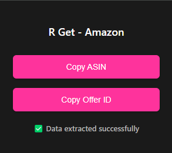

  

# R Get - Amazon ASIN & Offer ID Extractor

A Chrome extension that allows you to quickly copy ASIN and Offer ID from Amazon product pages.

## Features

- Extract ASIN (Amazon Standard Identification Number) from product pages
- Copy Offer ID from Amazon seller pages
- Works on multiple Amazon domains:
  - amazon.fr
  - amazon.de
  - amazon.com
  - amazon.co.uk
  - amazon.it
  - amazon.es
  - amazon.nl

- Simple one-click copy functionality
- Clean and intuitive interface

## How it Works

  
  
<em>When you open the extension on a product page, you'll see the "Data extracted successfully" message</em>

  
  
<em>Click the "Copy ASIN" button to copy the product's ASIN to your clipboard</em>

  
  
<em>Click the "Copy Offer ID" button to copy the product's Offer ID to your clipboard</em>

## Installation

### Manual Installation

1. Download or clone this repository
2. Open Chrome and navigate to `chrome://extensions/`
3. Enable "Developer mode" in the top right corner
4. Click "Load unpacked" and select the `OfferID-Amazon` folder
5. The extension icon should now appear in your Chrome toolbar

### Usage

1. Navigate to any Amazon product page
2. Click the extension icon in your toolbar
3. The ASIN will be automatically copied to your clipboard
4. For seller pages, the Offer ID will be copied instead

## Version History

- v0.1: Initial release

## License

This project is open source and available under the MIT License.
